# Adobe Offer Decisioning Engine Previewer

![aep-offer-decisioning-previewer](https://socialify.git.ci/PulkitXChadha/aep-offer-decisioning-previewer/image?description=1&descriptionEditable=Preview%20Offer%20representations%20for%20unified%20profile%20and%20test%20experiences%20delivered%20to%20your%20customers%20via%20Adobe%20Experience%20Platform.&forks=1&logo=data%3Aimage%2Fpng%3Bbase64%2CiVBORw0KGgoAAAANSUhEUgAAAOMAAADeCAMAAAD4tEcNAAAAxlBMVEUACx36DwD%2F%2F%2F%2F%2FDwAAAADrDwGiDREAABYACRy0Dg4AABMACxwAAA9OUVkABBrDxMf1DwBHSlPd3t%2FaDgjUDgm9vsAwNUEfJDGWmJx2eH3lDgUxCxrHDgunDRB8DBUJEiMAAAg4PEWcDREmCxtVDBhxDBayDQ46CxrFDgwYHi1kZ26ChInh4eOMjpOCDBSmDRAcCxt1DBVGCxmMDRNpDBdfDBcUCxyrrbHOz9GhoqYSGSlODBlaDBcYCxtRCxiTDBMsCxtBCxrj6IE5AAAII0lEQVR4nO2daXubOhCFsawU4ho70HpL2xs7XRPH6b4kbW9v%2F%2F%2BfusJLjEHAQRhG0sN5%2Bq12Om9GaEZHQnVYgcLRdOaPry48Rzd5F1djfzYd3RQhOHl%2F%2BWMV9DjnfXfg6YcoIL2B2xfx9YLVDzXGcBl9XUe2pLwoEcuwNOPQ53MT%2BHby5twflmIcTczIYFwim5MRzBguuEsdsZJcvpCNWAnj0lDCSC5fAozhFacOtJL4JJXKJOOdwUncyOV3%2BYzX3LSpJi2PX%2BcxBmaP0514kM24mFNHdyTNF1mMizl1bEfTAWSM0bdjoG7EfRnjtU2IAvI6zXhnF6KAvEsyhhYUjUN5PEwwTkwv%2FWm5k0PGpW0jNdKud3UsHamRdqN1wxj0qOOpRb1gzzi0caRG4sMHxrF9E85G7njHaG0at4l07H0aI%2FX8DeONlZPqVvxmzbiyd6gKxtWa0RlQB1KjBhGgqP%2FUcdQq0Qc4bGo541QwWjyrRhK9jsOM2tYoL2%2FOHMsfx%2BiBdEbWM46c1Zw6iJo1XzmzPnUQNas%2Fc3xb1xw7ub4ztrnLiTQYO%2Fd2lw5RPO4dDQ%2BlHFfeBXUErVq1atWqlURfLh9l6%2FILdXhH0O1ZN19nt9QhVtX7bqdI3UfUQVbT62JEAWn2eD2HGM%2Bpw6yifxFEAfmKOtAKegcyvqMOVF0fMEQB%2BYE6VGVdwozmTq0nIGKnc0YdqqqgwrFN5EfqYBX1pATjE%2Bpg1fQXRxSQn6jDVdJpKcZT6nCVVIIwgnxMHa%2BCPpdJo2D8Qx2wgs7L5bFzQh1weX0tl0YjVx9gqxpjfE4dclnBrWoM8hl10CX1SIHxBXXQJXVWGlGIOuhy%2Blg%2BjSKRZrlXJVrVmIzyPEq1qrFEmuR5lGpVY4wGlY%2FHSoQR5Evq0GH9UUujUZ4H7nEkZYznUbpVjSXyH%2BrgQT2vwGiI5%2FFMHdEYz%2BNFJUYzPI8KhB1DPI9%2FqqTREM9DrVXdywDP42dFRBM8j9IeR4rxKTVCkR5XRTTA81BuVWOMb6ghCqTeqsZEDZGvL9XTKBL5mRojV0%2BPwai351GpVd2r%2B4saJEdvjsSos%2BdxFMKO1p7HLZDGLtLraex5ANtx3VsPadq19TxegcEDNVRbzwNoVdeDEOiFdPU8kO249aGxb8gHf1LjSAWcHNse%2FgNsdE09D2A7bruh8QlJ5DdiHJmQk2O7Jg2oH1p6HkCr%2BrDBiGxPauh5vEXauIdPI%2BNaP88DaFVji19kftLO80C247pvHz7%2BG5l13ub8exQCTo4dJAbpF3TzPJBW9XXs80j50Mzz%2BFV6okTKh16eB7Ad1708%2BAZSPrTyPF4qNC5I%2BfhKgyMVcHIs9Z4K8h2dPA8kJ8mFBLT60MfzUHu2kPLxnoBGLmSOTC%2FskRfOtPE8kFonC1btV0MjZMkrO5sKmFe6eB7Idpx88ij%2Bni7nPBALSl4EVEoOjZBWVb4WVGkdSIRsx2Wt6ZHycZnx3SaFtKpZ3gziOmvgeUDjLfNcUdklGY2Ak2M5XimwC6SB54G0qjnzP%2FL1v83RSFW1jiPDgNrzQPqxvHeNoce5MRqpVFvVvZBpmdbzQLfjsoU4QaSex7fi%2BArXuUj5oPQ81FvVvZDyQel5ILvehWdtin8GpeeBtKrFzxJSPug8D2Q7rnhORA5nkXke0HYccAQeKR9Unke57bhsAe%2F1kF0HBWQR219DygfNOY%2FjrRmQjT0azwNpVcG1X3EeO93f9dJIhazh0R1E5Mmm8DyglxzAF4s0LR%2FIlkync%2FLmVKJ0zUTKR%2FOeB3jnmPwey9SqGeiYCDyPSi85pLsfpPNt2vMoceeYTClDESkfTR8TrPiSQ%2Brhgs73NPtqJNSq5oWbeiKRza9mPY%2FKLzmkejPkt9Zo06p8kcOeMdWbIQu1Jj2PkneOSeNNvgGIlI8mPY%2Byd47J4k2tupDy8V9jiBUucojFm%2FypiAHW3HVQld%2FHXceb3LBD9twba1oR%2Fx5Qqg9AykdT10Ep3DkmjTe5DwLcntSY56F055hEqXiR8tHMdVBKd45B8QJNcEOeR9WLHPbxplZLSPlowvNQvHNMGm%2FStUPKRxOeh%2BKdY9J4k6slZB%2BsgXMe1VvVOGRytYSUj%2Fo9jyO0qrF4kwMPKR%2F1ex5HucjhQam%2BBTFt6%2FY8kK3tEkodpEPKR93nPI5w58hBvArmVe2D9WgNwDbe1LgrXkbW3wZA%2F7MKSiiz2m67%2Bf9Ct%2F5ju97pydH0RHoe8tnpee6XTLrAtFWrVq1atWrVqlWrVq3s0YVHHUHN8i6ce%2BsZ753xgDqImjUYO75LHUTNcn1n1qcOomb1Z85qTh1EzZpPnRGnDqJm8ZETWs8YOqxvd%2FHw%2BsxhQY86jFrVCwTj1O7ByqeC0fIHkoeCkXk2dzoDASj%2BrGxOJF%2BtGW%2B4xTMrv1kzMt%2FemVXMqhvGob2DlQ%2B3jGxs69rDHbMdo7WJXKdxw2hrr7N%2BGneMoZVTqyfq%2F56RLW0crXzJ4oxsYt%2B0407YIaN9o3U3UveM7Ltto5V%2FZ0lGNrMLks9YmpH5NkFyn8kY2WJOHdnRNF8wOSMLbMkkD1gWoy3DNT5QU4xi4jG%2FhHix6UbGKEqI6c2Auy8aGYwsvDJ7vPJJmERKMUa9q7mrkN6uRy1gZGFg6IB1eZBKYgajWDRPDMxlj0%2BGUho5o6D0OTfJdx1w7ssJsxkZu1ndc94zoZR4Pc7vpzeZJNmMQuE0EF%2FnfXfg6cjqeQO3L%2BLrBVPZY4gxrtM5ms788ZWGR1y8i6uxP5uOcvki%2FQ8jRIFLjONcQgAAAABJRU5ErkJggg%3D%3D&owner=1&stargazers=1&theme=Light)

<p align="center">
  <a href="https://github.com/nsfw-filter/nsfw-filter/releases/" target="_blank">
    
  </a>
  <a href="https://github.com/PulkitXChadha/aep-offer-decisioning-previewer/commits/master" target="_blank">
    
  </a>
  <a href="https://github.com/PulkitXChadha/aep-offer-decisioning-previewer/issues" target="_blank">
    
  </a>
  </br>
  <a href="https://github.com/PulkitXChadha/aep-offer-decisioning-previewer/pulls" target="_blank">
    
  </a>
  <a href="https://github.com/nsfw-filter/nsfw-filter/blob/master/LICENSE" target="_blank">
    
  <a>
  </a>
</p>
<hr>

<br> </br>
Welcome to ODE Previewer an Adobe I/O Application to view Offer representations for a selected unified profile. Easily view and test the experiences delivered to your customers via Adobe Experience Platform.  
<br> </br>

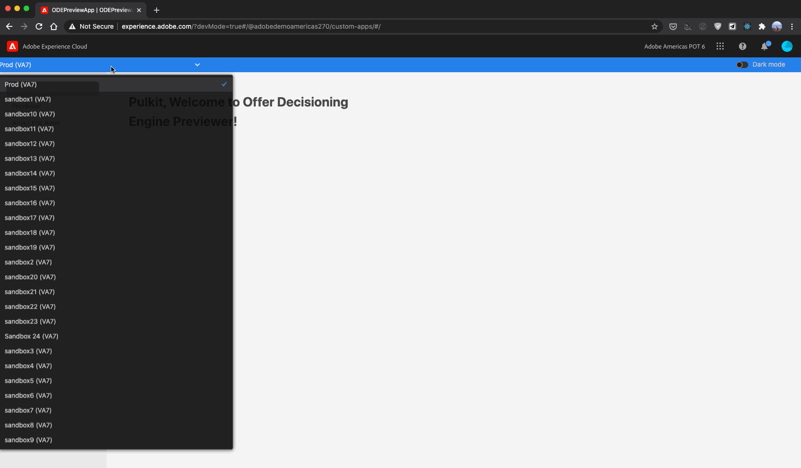

## Table Of Contents

- [Installation](#installation)
  - [Prerequisites](#prerequisites)
  - [Create Product Profile](#create-product-profile)
  - [Creating a new Project in Adobe Developer Console](#creating-a-new-project-in-adobe-developer-console)
  - [Install Project Locally](#install-project-locally)
  - [Test & Coverage](#test---coverage)
  - [Deploy & Cleanup](#deploy---cleanup)
- [Continuous Integration and Continuous Delivery (CI/CD)](#continuous-integration-and-continuous-delivery--ci-cd-)
- [Publishing your Firefly App](#publishing-your-firefly-app)
- [Project Folder Structure](#project-folder-structure)
- [Config Files](#config-files)
  - [`.env`](#-env-)
  - [`manifest.yml`](#-manifestyml-)
- [Additional Resources](#additional-resources)
  - [Adobe I/O](#adobe-i-o)
  - [Adobe Experience Platform - Unified Profile](#adobe-experience-platform---unified-profile)
  - [Adobe Offer Decisioning Engine](#adobe-offer-decisioning-engine)
- [Releases](#releases)
  - [v0.0.6](#v006)
  - [v0.0.5](#v005)
  - [v0.0.4](#v004)
  - [v0.0.3](#v003)
- [Features Requested](#features-requested)

## Installation

### Prerequisites

> To deploy and use this app you will need to provision Project Firefly on your Adobe Account. Follow the link for details on [How to Get Access to Project Firefly](https://www.adobe.io/apis/experienceplatform/project-firefly/docs.html#!AdobeDocs/project-firefly/master/overview/getting_access.md)

> Before you get started please ensure that you have all prerequisites on my workstation. Follow the link for details on how to [Setting up Your Environment](https://www.adobe.io/apis/experienceplatform/project-firefly/docs.html#!AdobeDocs/project-firefly/master/getting_started/setup.md)

### Create Product Profile

Access to all project Firefly apps is managed through [Adobe Admin Console](https://adminconsole.adobe.com). The recommended approach to managing access to the app using User Groups that have privileged Product Profiles. Follow the instructions below to set this up:

1. Create a user group with an appropriate name and description. Click `Save` when ready.

   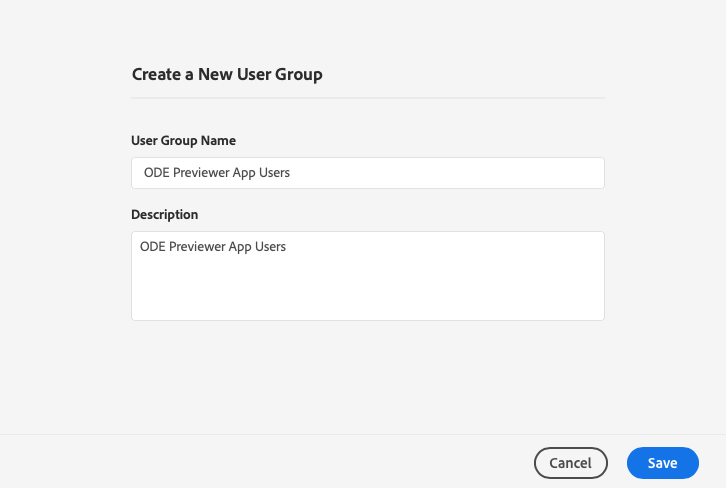

2. Create Adobe Experience Platform Product Profiles to manage privileges for the app workspaces. group with an appropriate name and description.

   - Go to Adobe Experience Platform Product in Admin console and click `New Profile`.
     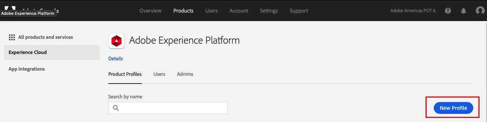

   - Give the Profile an appropriate name and description and click `Next` when ready.
     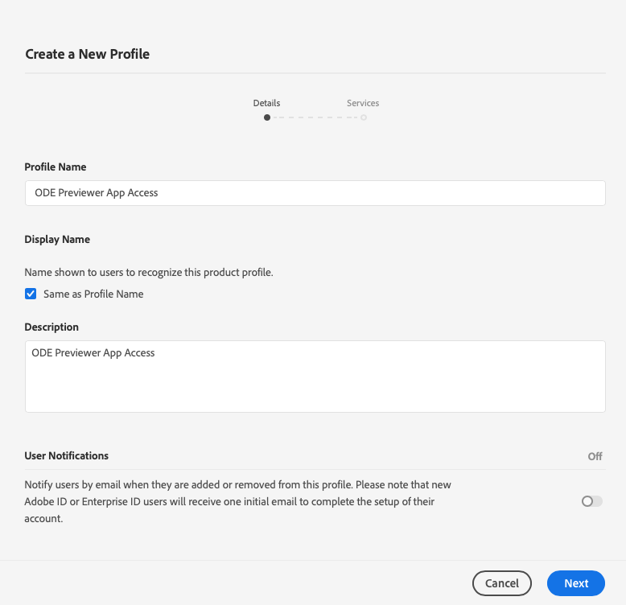

   - Make sure to enable **Offer Decisioning** service and click `Done` when ready.
     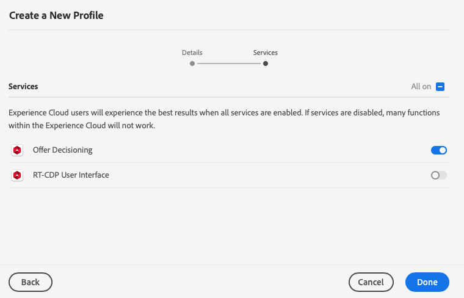

   - The app at least needs the following roles:

     - `View Sandboxes`
     - `View Profiles`
     - `Execute Decisioning Activities`

   - Once all roles have been selected click `Save` when ready.
     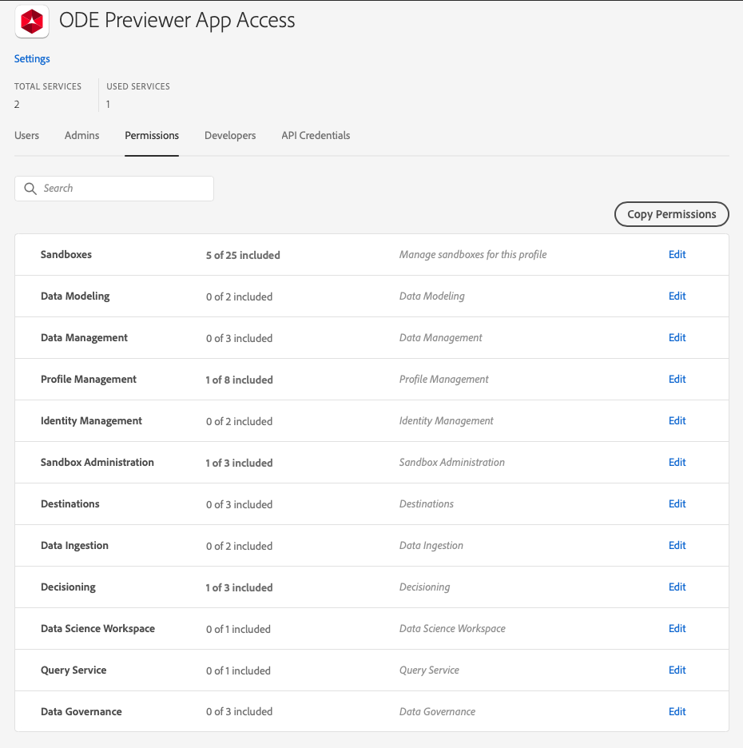

### Creating a new Project in Adobe Developer Console

Adobe Developer Console gives you access to APIs, SDKs, and developer tools to build on, integrate, and extend Adobe products. This app needs access to Adobe I/O Runtime credentials and access to Adobe Experience Platform APIs. Follow the instructions to set up your project:

1. Navigate to [Adobe Developer Console](https://console.adobe.io/).

2. Use the Org Switcher on the upper right corner to ensure or to select the Org you want to use.
   

3. Once you are in the correct organization, Under `Quick Start`, click on the option to `Create project from template`.
   **Note that if you don't this option, it might be because your request to access Project Firefly has not yet been approved.**

4. Select `Project Firefly` from the list of templates.
   

5. Enter `Project Title` and `App Name` for your templated project.

   - `Project Title` Give a descriptive title to e.e "**ODE Previewer \<\<company name\>\>**"
   - `App Name` Please enter "**ODEPreviewerApp**". This should match the project name in `package.json`

   - Click `Save` when ready.
     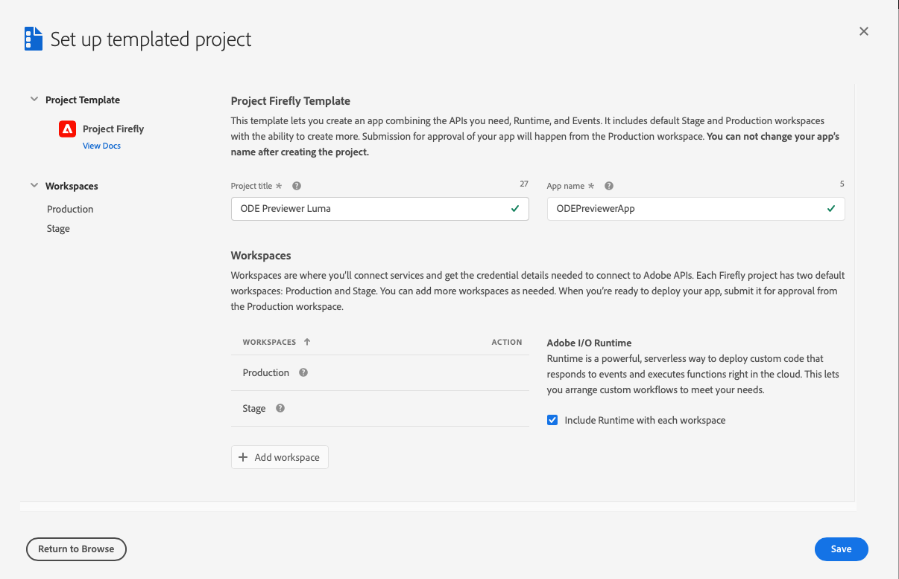

6. You should see a new project has 2 default `Workspaces`. It is recommended to create workspaces for individual developers working on a project.

   - Create a new workspace by clicking the `+ Add workspace` button. Give the workspace an appropriate name and description.

   - Click `Save` when ready.

     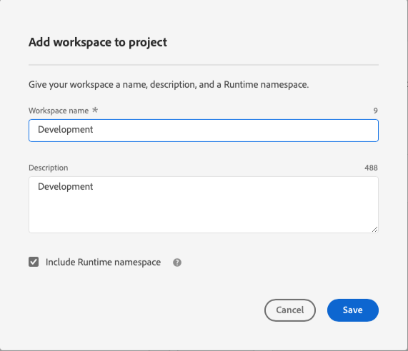

7. Within each of the workspace you will need to add the service needed for the app.

   - Click the `+ Add service` button and select `API`
     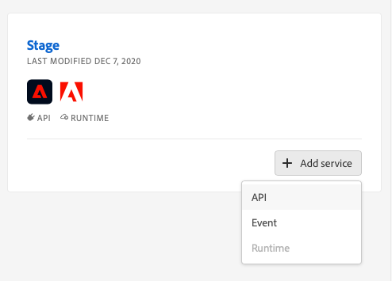

   - Click on `Adobe Experience Platform` then select the `Experience Platform API` tile, click `Next ` when ready.
     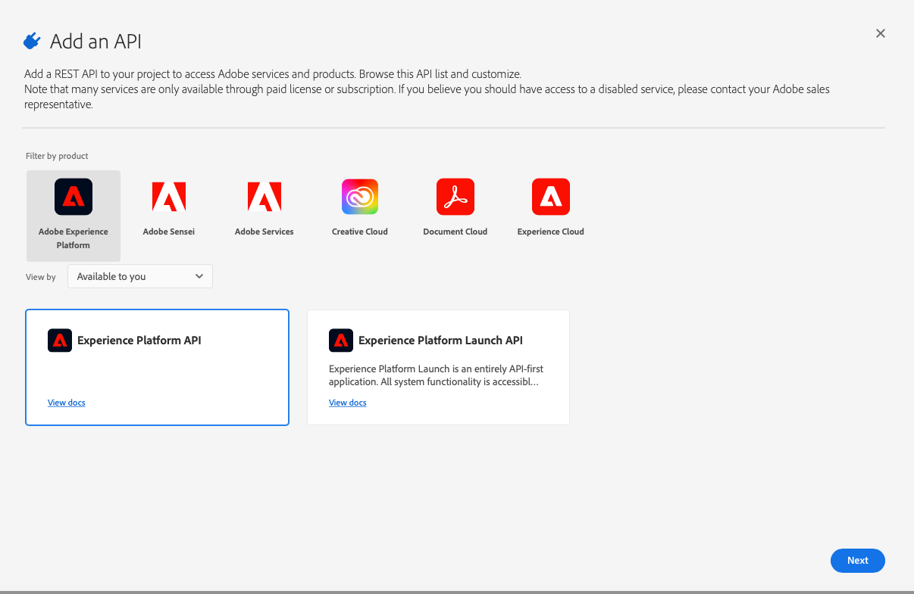

   - Select `Generate a new key pair` or upload a key pair you have already, click `Next ` when ready.
     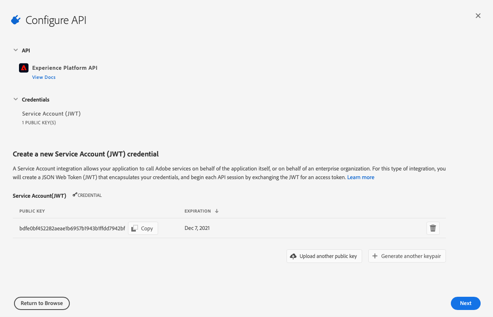

   - Select the product profile created for in preview sets and click `Save configured API`.
     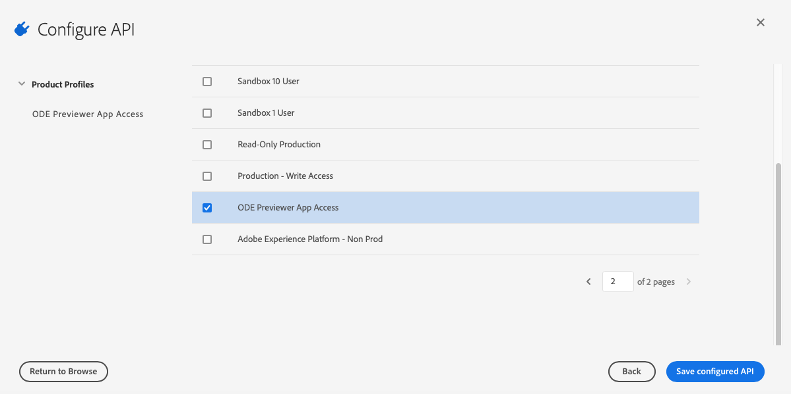

### Install Project Locally

1. On your machine, navigate to the Terminal and enter

   ```
   $ aio login
   ```

   This will open a browser window where you will need to enter your Adobe ID.
   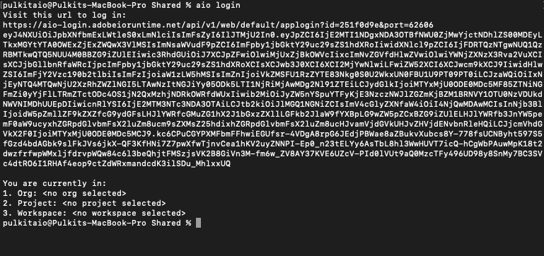

2. Clone the github repo

   ```
   $ git clone https://github.com/PulkitXChadha/aep-offer-decisioning-previewer.git
   ```

   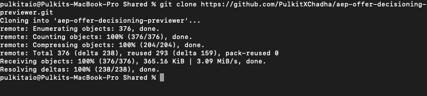

3. Change directory

   ```
   $ cd aep-offer-decisioning-previewer
   ```

4. Select the Organization, Project and workspace. the AIO CLI has helper commands to allow you to efficiently select the workspaces and have the app use the credentials associated with the workspace. The credentials included the `.aio`, `.env` and `config.json` files. You will need to run the following commands:

   - List all organizations you have access to `aio console org list`
   - Select the org you want to use `aio console org select <<IMS ORG>>`
   - List all Projects in the org `aio console project list`
   - Select the Project you want to use `aio console project select <<Project ID>>`
   - List all workspaces in the project `aio console workspace list`
   - Select the workspace you want to use `aio console workspace select <<workspace ID>>`
     

5. From within the project folder run the following command to downloads the relevant configuration files.

   ```
   $ aio app use
   ```

   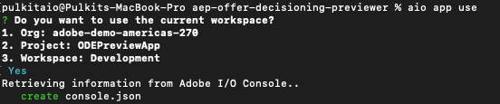

   This step will create `.aio`, `.env` and `config.json` files which include the credentials needed to run the app in the workspace.
   You can manually populate the `.env` file in the project root and fill it as shown [below](#env).

6. Install all node dependency libraries.From within the project folder run the following command

   ```
   $ npm install
   ```

   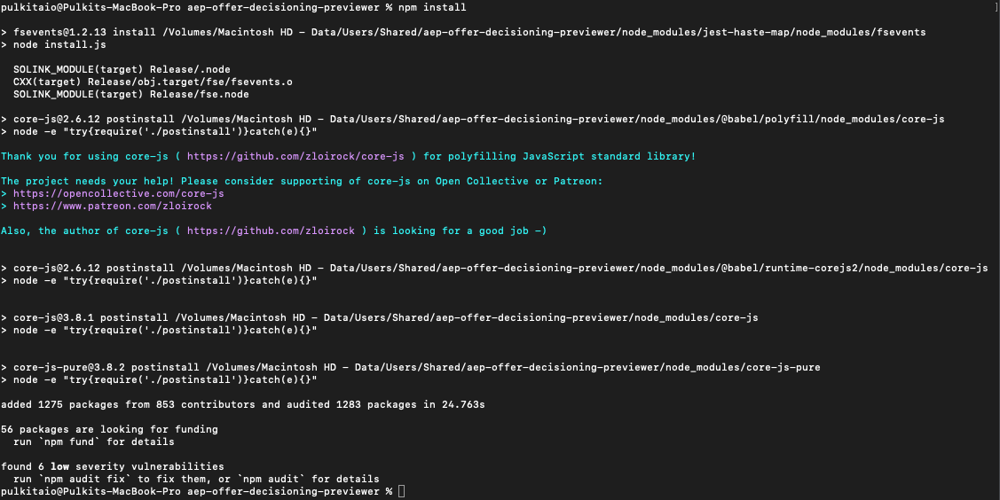

7. Run locally (this step needs docker and docker images, see details in the [above](#prerequisites)). Ensure that Docker is running on you machine and run the following command:

   ```
   $ aio app:run --local
   ```

   > This step might that a few mins at first.

   > you might need to accept a self-signed certificate to use `https://localhost:9080`
   > When successful you should see the below message.
   > 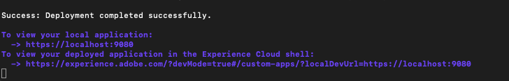

8. Copy and paste the URL `https://experience.adobe.com/?devMode=true#/custom-apps/?localDevUrl=https://localhost:9080` in a browser and you should see the app screen.
   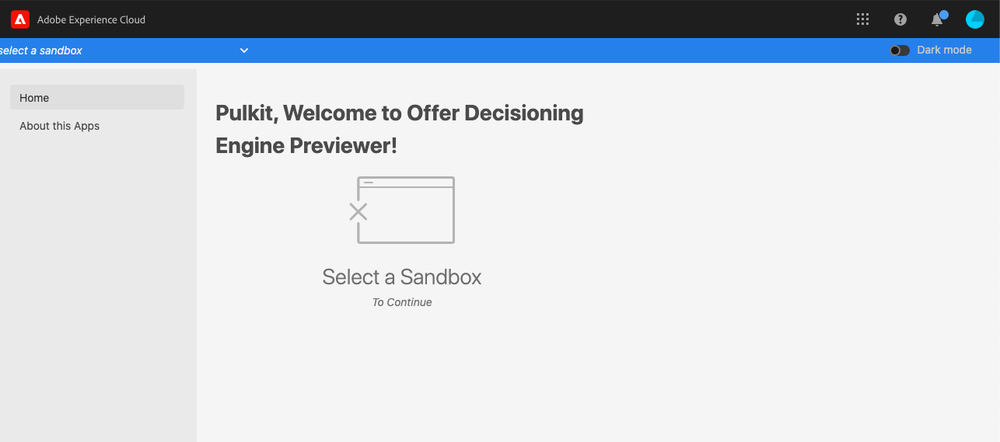

### Test & Coverage

- The project has > 150 unit tests for each of the UI and runtime actions. You can run these test by running the following command from the project folder

  ```
  $ npm run test
  ```

- To Run a test coverage report run the following command from the project folder
  ```
  $ npm run test-coverage
  ```

### Deploy & Cleanup

- `aio app deploy` to build and deploy all actions on Runtime and static files to CDN
- `aio app undeploy` to undeploy the app

## Continuous Integration and Continuous Delivery (CI/CD)

The repo uses GitHub Actions for CI/CD. The `.github/workflows` folder has all the workflows yml files used.

> You may need to modify and/or delete some of these workflow files.

For more information [CI/CD for Project Firefly Applications](https://www.adobe.io/apis/experienceplatform/project-firefly/docs.html#!AdobeDocs/project-firefly/master/guides/ci_cd_for_firefly_apps.md)

## Publishing your Firefly App

For instructions on how to publish and approve your app go to [Publishing a Project Firefly Applications](https://www.adobe.io/apis/experienceplatform/project-firefly/docs.html#!AdobeDocs/project-firefly/master/getting_started/publish_app.md)

---

## Project Folder Structure

```bash
├── actions  #this folder is intended for backend source code for all serverless actions
│   ├── misc
│   │   ├── get-aio-state.js # wrapper runtime action to get a state value from aio-lib-state
│   │   ├── update-aio-state.js # wrapper runtime action to set a state value from aio-lib-state
│   ├── ODE
│   │   ├── get-activities.js # action to get a list of all ODE activities in the AEP instance
│   │   ├── get-container.js # action to get the ODE container ID for the sandbox selected.
│   │   ├── get-decision-rules.js # action to get the details of Decision Rule.
│   │   ├── get-fallback-offer-details.js # action to get fallback offer meta data.
│   │   ├── get-offer-details.js # action to get offer meta data details.
│   │   ├── get-offer-metrics.js # action to get capping metrics for the offer.
│   │   ├── get-offer-representation.js # action to get the ODE container ID for the sandbox selected.
│   │   ├── get-placements.js # action to get the ODE container ID for the sandbox selected.
│   ├── PALM
│   │   ├── get-sandboxes.js # action to get a list of all sandboxes in the AEP instance
│   ├── UPS
│   │   ├── get-identity-namespaces.js # action to get list of all Identity Namespaces.
│   │   ├── get-identity-preview-report.js # action to get list of all populated Identity Namespaces.
│   │   ├── get-profile-experience-events.js # action to get experience events for the profile.
│   │   ├── get-profile.js # action to get Unified Profile based on an entity value lookup.
│   ├── utils.js
├── web-src   #this folder is intended for frontend source code such as html templates, react components, JS, CSS
│   ├── index.html
│   ├── src
│   │    ├── components
│   │    │    ├── About.js
│   │    │    ├── ActivityList.js  # React Component for Activity Picker.
│   │    │    ├── App.js
│   │    │    ├── EligibilityRuleDetails.js # React Component for displaying Eligibility Rule details.
│   │    │    ├── ExperienceEventsView.js # React Component for displaying Experience Event Data.
│   │    │    ├── FallbackOfferDetails.js # React Component for Fallback offer details.
│   │    │    ├── Home.js
│   │    │    ├── NamespaceList.js # React Component for Identity Namespace drop down.
│   │    │    ├── OfferDetails.js # React Component for displaying offer meta data details.
│   │    │    ├── OfferPropositionMetricView.js # React Component for displaying Capping metric bar.
│   │    │    ├── OfferRender.js   # React Component to Render Offer Content.
│   │    │    ├── PlacementList.js  # React Component for Placement drop down.
│   │    │    ├── Previewer.js  # React Component for the Previewer Page.
│   │    │    ├── ProfileView.js  # React Component for displaying Experience Event Data.
│   │    │    ├── PropositionHistoryView.js  # React Component to display Proposition History.
│   │    │    ├── SandboxPicker.js  # React Component for Sandbox Picker Ribbon.
│   │    │    ├── SideBar.js  # React Component for Side Bar.
│   │    ├── context
│   │    │    ├── ProfileViewContext.js # React Context for profile attributes in decision rules.
│   │    │    ├── UserSettingsContext.js # React Context for user settings for the app.
│   │    ├── hooks
│   │    │    ├── useActionWebInvoke.js # React Custom Hook for caching runtime action responses.
│   │    ├── exc-runtime.js
│   │    ├── index.css
│   │    ├── index.js
│   │    ├── utils.js
├── e2e  #this folder is intended for end-to-end tests
├── test  #this folder is intended for back-end action unit tests and integration tests
│   ├── actions # contains all unit tests for runtime actions.
│   ├── web-src # contains all unit tests for UI components.
├── manifest.yml #this file describes the backend actions you would like to deploy or to redeploy
├── README.md
├── package.json #this file describes project definition and various metadata relevant to the project.
└── .gitignore
```

---

## Config Files

### `.env`

```bash
# This file must not be committed to source control

## please provide your Adobe I/O Runtime credentials
AIO_runtime_auth=
AIO_runtime_namespace=
AIO_runtime_apihost=
## Adobe I/O Console service account credentials (JWT) Api Key
SERVICE_API_KEY=
```

### `manifest.yml`

- List your backend actions under the `actions` field within the `__APP_PACKAGE__`
  package placeholder. We will take care of replacing the package name placeholder
  with your project name and version.
- For each action, use the `function` field to indicate the path to the action
  code.
- More documentation for supported action fields can be found
  [here](https://github.com/apache/incubator-openwhisk-wskdeploy/blob/master/specification/html/spec_actions.md#actions).

---

## Additional Resources

### Adobe I/O

- [Firefly Apps](https://github.com/AdobeDocs/project-firefly/blob/master/README.md#project-firefly-developer-guide)
- [Adobe I/O SDK](https://github.com/adobe/aio-sdk#adobeaio-sdk)
- [Adobe I/O Runtime](https://adobedocs.github.io/adobeio-runtime/)
- [React Spectrum](https://react-spectrum.adobe.com/react-spectrum/index.html)

### Adobe Experience Platform - Unified Profile

- [Overview](https://experienceleague.adobe.com/docs/experience-platform/profile/home.html?lang=en)
- [Unified Profile API Reference](https://experienceleague.adobe.com/docs/experience-platform/profile/home.html?lang=en#api)

### Adobe Offer Decisioning Engine

- [Getting Started](https://experienceleague.adobe.com/docs/offer-decisioning/using/get-started/starting-offer-decisioning.html?lang=en#get-started)
- [Offer Decisioning API Reference](https://experienceleague.adobe.com/docs/offer-decisioning/using/api-reference/getting-started.html?lang=en#api-reference)

## Releases

### v0.0.6

- Added event count to the Experience Events tab title.
- Separated Github workflows per Org deployment.

### v0.0.5

- Added validation to Get Offer button be disabled if any of the inputs are not populated.
- Does not cache Experience Events responses to session/local storage
- Added IMS user's first name to the greeting of the app.
- Added support for Dark Mode.
- Used State SDK to store dark mode setting.
- Document How to install the app on a new IMS org.
- Document how to use the App
- Bug Fixes
  - Updated profile data error message
  - Offer Metric Bar only displayed when metric has been created.

### v0.0.4

- Added session caching of API responses to improve App performance.
- Updated Offer Metric component to not cache API responses.
- Disable Placements not part of the activity selected
- Profile JSON collapse all attributes that are not part of the decision condition.

### v0.0.3

- Added support to render JSON and HTML representation of offers
- Sort sandbox list based on name.
- Cleaned display of events data removing data types and length.
- Added dry run toggle to switch between various modes of offer decisioning.
- Added offer capping metric Meter component to offer details.

## Features Requested

- Show sample profiles based on decision rule.
- Show proposition history events.
- Show lineage followed to make the offer decision.
- Show Decision API call.
- Add integration tests.
- Add better error handling.
